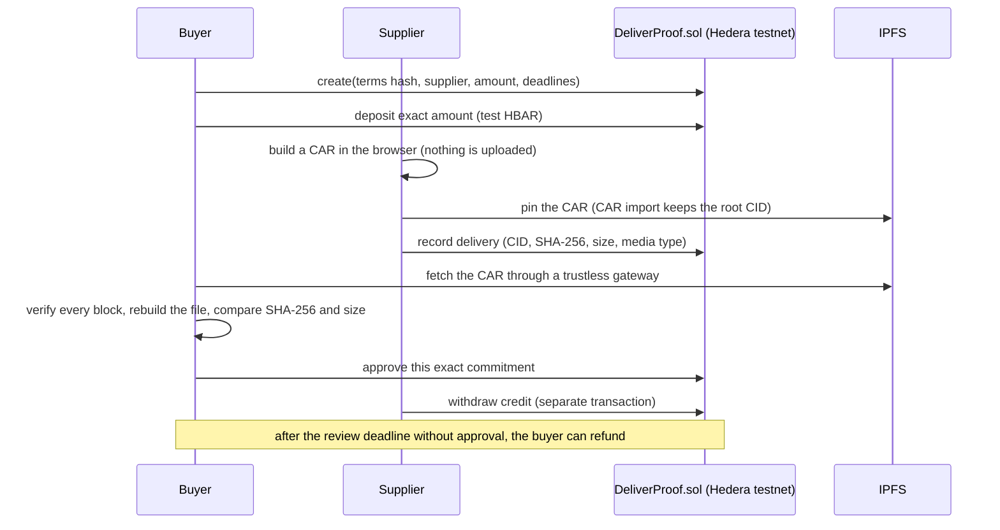

# DeliverProof

**Pay for a digital delivery only after the buyer has verified the exact bytes and explicitly approved them. Hedera testnet only.**

DeliverProof is a Scaffold-HBAR template for one buyer, one supplier, one file and a Solidity escrow designed for Hedera testnet. In the intended public workflow, the supplier publishes the file on IPFS and records a commitment on chain: the CID, SHA-256, size and media type. The buyer checks the file in the browser against that commitment and then approves. Approval creates credit for the supplier. Withdrawal is a separate transaction. **Silence never releases money:** after the review deadline, the buyer can reclaim the deposit.

Anyone can check an agreement without a wallet. The verifier replays the contract's history from its public deployment, checks every event and receipt, and reads the stored state at one block. When the data it needs is missing it answers `inconclusive`. It never guesses a success.

> **Current status: source review package, not yet a published template or live Hedera demo.**
> Cloud-local EVM and simulated-wallet evidence exists. Our Hedera deployment,
> public IPFS retrieval and public CLI installation are still pending. The
> shipped deployment manifest is `null`; the UI shows a disabled source preview.
> [Validation status](docs/STATUS.md) separates accepted evidence from candidates.

## Evaluator setup

Requirements:

- Recommended recorded runtime: Node.js **22.22.2 with npm@10.9.7**.
- The accepted Node 20 correction has cloud results on 20.18.3/npm@10.8.2,
  22.22.2/npm@10.9.7 and 24.21.0/npm@11.19.0. Its source-to-result correspondence
  is recorded in [STATUS](docs/STATUS.md). Node 20.18.3 reports dependency
  `EBADENGINE` warnings: Vite and eslint-visitor-keys require at least 20.19.0
  on that major line. Passing commands do not establish engine-strict support.
- Declared major ranges are 20.18.3–20.x, 22.18.0–22.x and 24.0.0–24.x;
  they are not a claim that every newer Node or package-manager version was tested.
- git with `user.name` and `user.email` set (the Scaffold-HBAR CLI checks this)

The external-template command below is a **pending publication recipe**, not a
working public download. Replace the placeholders only after an authorized public
repository exists and a clean external install has been recorded. Select Next.js,
Hardhat, testnet and the package manager npm. In the current source checkout, use the
[installation guide](docs/INSTALL.md#reproducible-installation-gate) in the
owner-authorized cloud environment; do not run the project on the owner's Mac.

```sh
npx create-scaffold-hbar@latest --template ⟨OWNER/REPO⟩
cd ⟨project-folder⟩
npm run check
npm run core:test
npm run hardhat:test
npm run next:build
npm run next:start
```

After an accepted cloud build, open http://127.0.0.1:3000. With the stock null
manifest, expect a disabled source preview. After a reviewed public deployment
manifest is installed, enter its documented agreement number and press **Verify
agreement**. The intended result shows the state, participants, deposit, snapshot
block and checked event history without connecting a wallet. There is no public
contract address or sample agreement number to use yet.

## Public evidence — pending

No row below is claimed as completed. Fill it with verified public links after the
authorized testnet/IPFS run. A submitted hash alone does not satisfy acceptance.

| Required evidence | Current state |
| --- | --- |
| Public repository and fresh external CLI installation | Pending |
| Contract address, runtime hash and canonical deployment receipt | Pending |
| First agreement creation and exact deposit (tinybar × 10^10 in RPC) | Pending |
| Delivery commitment, preserved-root CID and public CAR retrieval | Pending |
| Buyer approval and separate supplier withdrawal receipts | Pending |
| Second agreement refund and separate buyer withdrawal receipts | Pending |
| Verifier observation/export and screenshot for the same agreements | Pending |

## How it works



States: `Draft → Funded → Submitted → Approved`, or `Funded/Submitted → Refunded`. Approved and Refunded each create one credit. Only `withdraw` pays it.

| Package | What it contains |
| --- | --- |
| `packages/hardhat` | `DeliverProof.sol` (no admin, no upgrades, no fees, reentrancy guard), contract tests, and a deployment script with an exclusive attempt journal and read-only recovery; uncertain attempts block another send |
| `packages/core` | Delivery commitment, CAR/UnixFS verification with limits, and the network verifier (`verifyAgreement`), which returns `verified`, `mismatch` or `inconclusive` with a reason code |
| `packages/nextjs` | The app: create, deposit, prepare the CAR, verify, record, approve or refund, withdraw, evidence export |

The full protocol, including the commitment encoding and limits, is in [docs/PROTOCOL.md](docs/PROTOCOL.md).

## Hedera details handled for you

The implementation handles these differences. Recorded public relay samples
(`testnet.hashio.io`) concern third-party contracts; they do not validate our
DeliverProof deployment. Cloud-local tests and the outstanding chain-296 checks
are separated in [STATUS](docs/STATUS.md).

- **Units.** Solidity on Hedera sees tinybar (8 decimals). JSON-RPC `value` uses 18 decimals, so it is tinybar × 10^10. The app and the deploy script convert explicitly and never use floating point.
- **Log limits.** `eth_getLogs` refuses ranges over 7 days (`-32004`). The verifier reads history in 6-day windows. A result that is too large (`-32011`, mirror node pagination) counts as a failed read, which is reported as `inconclusive` and never as a partial history.
- **Addresses.** A contract created by an Ethereum transaction has an EVM address (not long-zero) in the receipt and in its logs. The verifier checks that address against the reviewed deployment.
- **History.** State is read at one fixed block with historical `eth_call`, and receipts are checked against the block hash from `eth_getBlockByNumber`.

## Using the app with a wallet (testnet)

This route requires an accepted deployment and the owner's applicable account,
faucet and transaction authorization; it has not been completed for this package.

1. Add Hedera testnet to an EVM wallet: RPC `https://testnet.hashio.io/api`, chain ID 296.
2. Get test HBAR for two test accounts (buyer and supplier) at the Hedera portal faucet.
3. Follow the workflow in [docs/INSTALL.md](docs/INSTALL.md#workflow-and-file-availability). Use public synthetic files only, up to 1 MiB.

Every transaction asks your wallet for confirmation. An unknown result locks
further sends in the current page session. Only evidence tied to the original
transaction can resolve it. If no original hash was returned, pasting a hash is
an independent observation and does not release the attempt. The lock is in
memory: reloading or opening another tab does not prove retrying is safe.
The app never automatically resends a transaction.

## Deploy your own copy

The script's **testnet mode** accepts only chain 296 at the fixed hashio endpoint.
Its separate local rehearsal mode uses chain 31337. Neither reads `.env` files.
Obtain the applicable deployment authorization before running these commands.

| Variable | Value | When |
| --- | --- | --- |
| `DELIVERPROOF_TESTNET_AUTHORIZED` | `yes` | required to deploy to testnet |
| `DELIVERPROOF_TESTNET_PRIVATE_KEY` | test account key | set only in the protected environment of the process; never in a file, a command argument or a log |
| `DELIVERPROOF_RECOVERY_TX` | public transaction hash | only for `--recover-testnet`, when a deploy response was lost |

```sh
npm run hardhat:deploy:testnet
# review packages/nextjs/lib/deployment.candidate.json, then copy it to deployment.json
npm run next:build
```

If a deploy is interrupted, preserve its attempt journal and compiled artifact;
do not deploy again from this or a fresh checkout. Run
`node scripts/deploy.cjs --recover-testnet` from `packages/hardhat`. It only reads
the chain and never signs. Review [recovery limits](docs/INSTALL.md#recovery-after-a-lost-deployment-response-cloud-only)
before accepting a candidate.

## Local EVM rehearsal in the authorized cloud

Follow [the isolated rehearsal procedure](docs/INSTALL.md#cloud-only-local-evm-rehearsal)
for compilation, loopback node, explicit local deployment and manifest review.
Do not run these steps on the owner's Mac or copy a local address into the public
evidence table. Tests deploy fixtures only to a disposable local chain; this is
not a Hedera testnet deployment. A local pass does not prove Hedera's currency
conversion. The real testnet evidence remains pending.

## Tests

| Suite | Command | Checks |
| --- | --- | --- |
| Core (vitest) | `npm run core:test` | 53 passed on 15c65ba: commitments, CAR limits and tampering, verifier codes, property test of the log windows |
| Contract (Hardhat) | `npm run hardhat:test` | 38 passed on 15c65ba: deadlines, exact deposit, credits and withdrawal, reentrancy, liability invariant, deploy journal and recovery |
| Chain (vitest + local node) | `npm run chain:test` | 43 passed on 15c65ba: Solidity/TypeScript commitment vectors, reorgs, missing logs, wrong contract, unit scaling, read failures |

The table refers to the accepted cloud Node-compatibility results on 15c65ba,
not a fresh run of every documentary commit. Executable source, configuration
and lockfile match that tested source. See [STATUS](docs/STATUS.md) for exact source correspondence and
acceptance. `npm run next:lint`, `npm run next:check` before and after
`npm run next:build`, and `npm run format:check` complete the checks. One known
lint warning remains. Formatting excludes Markdown and evidence artifacts, so a
passing formatter is not documentation validation.

## Limits

- Testnet only. There is no mainnet configuration. Each agreement holds at most 10 test HBAR.
- Byte verification establishes correspondence to the recorded commitment. It does not establish authorship, quality, recipient acceptance or when the recipient obtained the file.
- A CID does not guarantee continuing availability. Preserve the CAR and use authorized pinning; successful offline verification is not public IPFS availability.
- There is no arbitration. Silence never pays the supplier; the buyer can refund after the review deadline even if a file was submitted.
- Direct EOA participants only; general smart-wallet/forwarding-contract support is not claimed.
- The deployment journal protects one preserved checkout. Storage durability and real-network recovery still need their documented acceptance checks.
- ESLint 9.39.5 is a recorded temporary unsupported development-tool exception; see STATUS for the separately validated replacement requirement.

## AI-assisted development

See [AGENTS.md](AGENTS.md) for the invariants and checks an AI coding assistant must follow in this project.

## License

MIT. Original work. The official Scaffold-HBAR layout and manifest format were followed for compatibility. Sources: [docs/SOURCES.md](docs/SOURCES.md).
